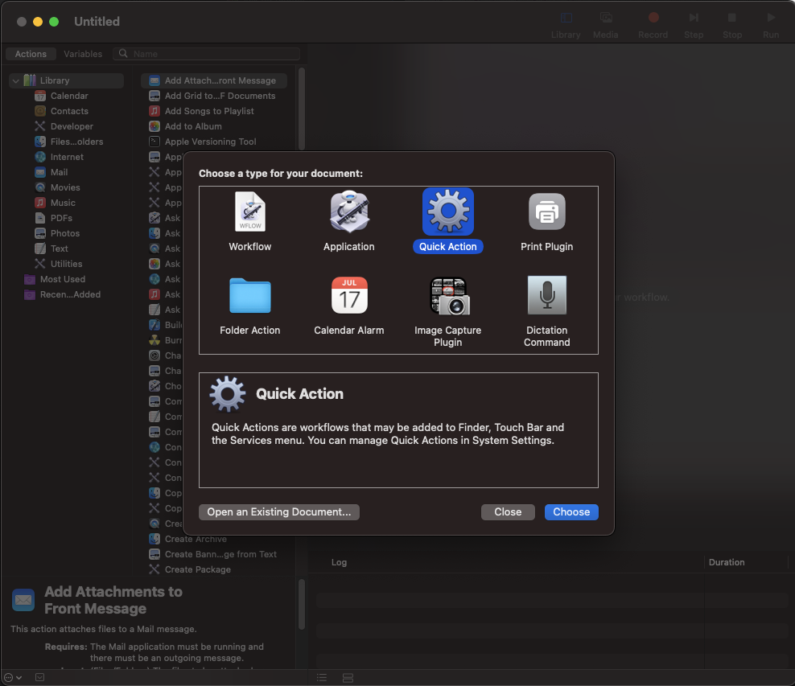
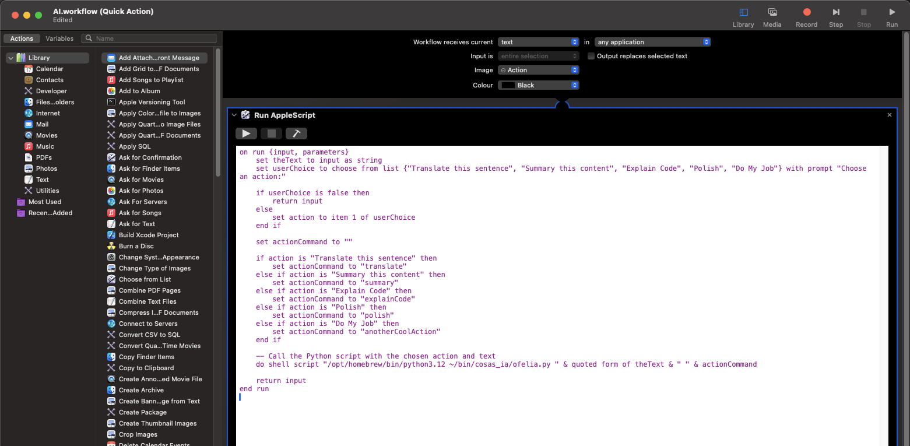
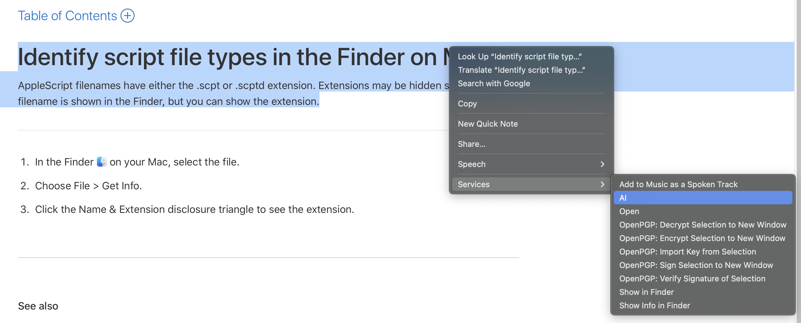
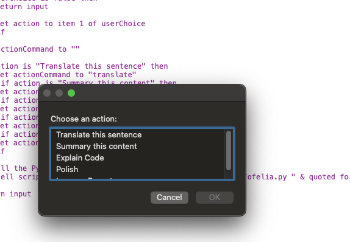
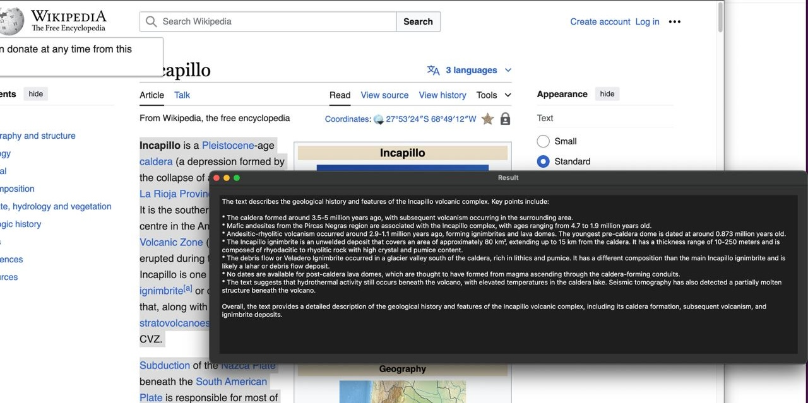

# OfelIA


## OfelIA: Privacy-Preserving Contextual Assistant
OfelIA is an offline (an pretty simple) contextual assistant that integrates with macOS, allowing users to select text and perform actions like translating and summarizing content directly from the contextual menu. This project uses Ollama to run advanced language models locally, thus ensuring user data privacy and security.
  
### Features

- **Integration with macOS contextual menu:** Easy access to assistant functionalities via right-click on selected text.
- **Completely offline operation:** No internet connection required, preserving user data privacy.
- **Support for multiple language models:** Supports all models that Ollama supports, such as llama3:latest and phi3:latest.
- **Flexible configuration:** Parameters like temperature, tokens, and specific prompts are managed via a JSON configuration file.

### Requirements
- macOS
- Python 3
- PyQt5
- Ollama 

### Installation

1. **Clone the repository**
```
git clone https://github.com/yourusername/OfelIA.git
cd OfelIA
```

2. **Install dependencies**
`pip install PyQt5 requests`

3. **Configure Ollama**
Verify that Ollama is properly installed and running on your local machine at `http://localhost:11434/v1/`. If you're utilizing a different configuration, please update the settings in `ofelia.py` accordingly.

#### Configuration

1. **JSON Configuration File**
Edit the `config.json` file to specify the models and parameters for each action:
```json
{
	"translate": {
		"prompt_template": "Translate this to Spanish. Response Only with the Spanish sentence: {text}",
		"model": "llama3:latest",
		"max_tokens": 5000,
		"temperature": 0.2
},
	"summary": {
		"prompt_template": "Summary this text: {text}",
		"model": "llama3:latest",
		"max_tokens": 5000,
		"temperature": 0.5
	},
	"explainCode": {
		"prompt_template": "Explain the following code: {text}",
		"model": "llama3:latest",
		"max_tokens": 5000,
		"temperature": 0.3
	},
	"polish": {
		"prompt_template": "Check the following content for possible diction and grammar problems, and polish it carefully: {text}",
		"model": "llama3:latest",
		"max_tokens": 5000,
		"temperature": 0.2
	},
	"anotherCoolAction": {
		"prompt_template": "Do my job: {text}",
		"model": "llama3:latest",
		"max_tokens": 5000,
		"temperature": 0.2
	}
}
```

2. **Python Script**
Ensure that the python script (`ofelia.py`) is located in the same directory as the `confif.json` file.

3. **Automator Script**
* Open Automator.app and choose the wheel "Quick Action":


* Select `Workflow receives current` "text" `in` "any application"
* Drag or pick "Run AppleScript" (copy/paste the content of `ofelia.scpt`)
* Save as a cool name for Example: "IA"


### Usage
Select any text within an application. Then, navigate to the 'Services' menu and choose 'AI' or the cool name you've assigned to your Automator script.


Once you click on the option, a new menu appears, allowing you to select one of the actions or prompts that were previously configured in your `config.json` file.


Wait a bit, and a new popup appears with the output:


**Nice Tricks:**
* Go to System Preferences > Keyboard > Shortcuts. Select Services from the sidebar and find your service. Add a shortcut by double clicking. Finally go to System Preferences > Security > Privacy > Accessibility and add Automator and the preferred app to run the shortcut.
* One of the most important things is to have good prompts. There are some cool places where you can find great ideas (https://github.com/danielmiessler/fabric/tree/main/patterns)

