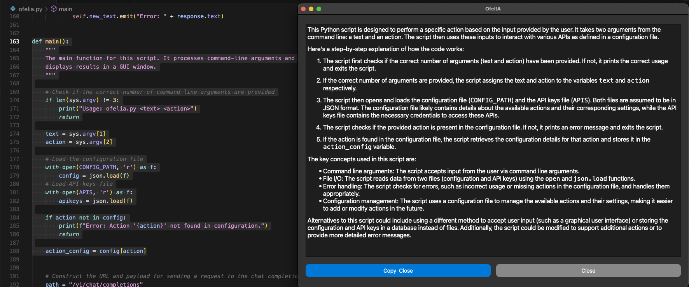

# OfelIA


## OfelIA: Privacy-Preserving Contextual Assistant
OfelIA is an offline (and pretty simple) contextual assistant that integrates with macOS, allowing users to select text and perform actions like translating and summarizing content directly from the contextual menu. This project primarily uses **Ollama** to run advanced language models locally, ensuring user data privacy and security. Additionally, OfelIA now supports external AI providers via API keys, such as **Claude, OpenAI, Mistral**, and others, as long as they follow OpenAPI-compatible endpoints.
  
### Features

- **Integration with macOS contextual menu:** Easy access to assistant functionalities via right-click on selected text.
- **Completely offline operation (with local models):** No internet connection required when using Ollama, preserving user data privacy.
- **Support for external AI providers:** Users can configure external APIs (e.g., Mistral, Claude, OpenAI) by providing an API key in a configuration file.
- **Support for multiple language models:** Supports all models that Ollama and external providers offer, such as `llama3:latest`, `mistral-large-2407`, `codestral-2405`.
- **Flexible configuration:** Parameters like temperature, tokens, and specific prompts are managed via a JSON configuration file.
- **Support output in Markdown:** When the output is in Markdown, OfelIA renders it.

### Requirements
- macOS
- Python 3
- PyQt5
- Ollama (optional if using external APIs)

### Installation

1. **Clone the repository**
```sh
git clone https://github.com/dan1t0/OfelIA
cd OfelIA
```

2. **Install dependencies**
```sh
pip install PyQt5 requests
```

3. **Configure AI Providers**
OfelIA allows the use of both local (Ollama) and external AI models.
Configuration is done via `config.json` and `apikey.json`.
Ensure you rename `config.json` to `config.json.sample` and `apikey.json.sample` to `apikey.json` with your specific configuration

#### Configuration

1. **JSON Configuration File**
Edit the `config.json` file to specify the models and parameters for each action:
```json
{
    "translate": {
        "system_prompt": "I'm ready to help. Please provide the English sentence you'd like me to translate into Spanish. I'll respond only with the translated sentence.",
        "user_prompt": "{text}",
        "provider": "mistral",
        "model": "mistral-large-2407",
        "max_tokens": 5000,
        "temperature": 0.2
    },
    "summary": {
        "system_prompt": "I am your assistant for summary writing. Please provide the text you'd like me to summarize. If the text is in Spanish I will respond in Spanish, if not I will respond in English. I will add the main points and key details in the summary.",
        "user_prompt": "{text}",
        "provider": "mistral",
        "model": "mistral-large-2407",
        "max_tokens": 5000,
        "temperature": 0.5
    },
    "explainCode": {
        "system_prompt": "Please explain how this code works, including any key concepts or algorithms used.",
        "user_prompt": "{text}",
        "provider": "ollama",
        "model": "llama3:latest",
        "max_tokens": 5000,
        "temperature": 0.3
    },
    "polish": {
        "system_prompt": "Check the following content for possible diction and grammar problems, and polish it carefully. I'll respond only with the fixed sentence.",
        "user_prompt": "{text}",
        "provider": "ollama",
        "model": "llama3:latest",
        "max_tokens": 5000,
        "temperature": 0.2
    },
	"anotherCoolAction": {
	"system_prompt": "Do my job:",
        "provider": "ollama",
	"user_prompt": "{text}",
	"model": "llama3:latest",
	"max_tokens": 5000,
	"temperature": 0.2
	}
}
```

2. **API Keys Configuration (`apikey.json`)**
If you wish to use external AI providers, add your API keys to `apikey.json`:
```json
{
    "mistral": {
        "url": "https://api.mistral.ai/",
        "key": "your_api_key_here"
    },
    "ollama": {
        "url": "http://localhost:11434/",
        "key": "dummy"
    },
    "claude": {
        "key": null
    }
}
```
If an API key is set to `null`, that provider will not be used.

3. **Python Script**
Ensure that the python script (`ofelia.py`) is located in the same directory as the `config.json` and `apikey.json` files.

4. **Automator Script**
* Open Automator.app, create "New Document" and choose "Quick Action":

* Select `Workflow receives current` "text" `in` "any application"
* Pick the "Run AppleScript" action
* Copy paste the content of `ofelia.scpt` and manually adjust the path to `ofelia.py`
* Save as a cool name, for example: "AI"


### Usage
Select any text within an application. Then, navigate to the 'Services' menu and choose 'AI' or the name you assigned to your Automator script.


Once you click on the option, a new menu appears, allowing you to select one of the actions or prompts that were previously configured in your `config.json` file.


The following example shows the "Explain Code" functionality:


The following example shows the "Summarize this content" functionality:


**Nice Tricks:**
* Go to **System Preferences > Keyboard > Shortcuts**. Select **Services** from the sidebar and find your service. Add a shortcut by double-clicking. 
* Finally, go to **System Preferences > Security > Privacy > Accessibility** and add Automator and the preferred app to run the shortcut.
* One of the most important things is to have **good prompts**. You can find great ideas here: [Prompt Engineering Patterns](https://github.com/danielmiessler/fabric/tree/main/patterns).
